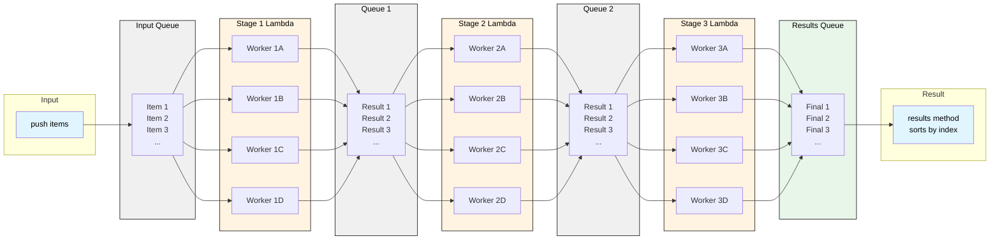

# 🌊 RapidFlow

⚙️💎➡️📦💨🔁🌊
> A Ruby library for concurrent batch data processing through lightweight, composable flows.

[](https://badge.fury.io/rb/rapidflow)
[](LICENSE)

> Note: ⚠️ This library is at a very early stage of development. The interfaces and APIs 
> may change without backward compatibility guarantees in minor versions (0.[minor version].[patch]).

RapidFlow is a lightweight, concurrent pipeline processor for Ruby that transforms data through multiple stages using Ruby Threads. 
Perfect for I/O-bound operations like web scraping, API calls, and data processing.

## Features

- 🚀 **Concurrent Processing** - Multiple workers per stage process items concurrently
- 🔄 **True Pipelining** - Different stages process different items simultaneously
- 📦 **Order Preservation** - Results returned in the same order items were pushed
- 🛡️ **Error Handling** - Captures exceptions without stopping the flow
- 🎯 **Simple API** - Easy to use, no complex configuration
- 🪶 **Zero Dependencies** - Uses only Ruby's standard library

## Requirements

- Ruby >= 3.2
- No external dependencies

## Installation

Add this line to your application's Gemfile:

```ruby
gem 'rapidflow'
```

And then execute:

```bash
$ bundle install
```

Or install it yourself as:

```bash
$ gem install rapidflow
```

## Quick Start

Create a batch instance.

```ruby
require 'rapidflow'

# Create a 3-stage processing batch. Workers can be configured per stage basis or will use the default amount if omitted.
scraper = RapidFlow::Batch.build do
  stage ->(url) { fetch_html(url) }, workers: 8 # Stage 1: Fetch HTML
  stage ->(html) { parse_data(html) }, workers: 2 # Stage 2: Parse data
  stage ->(data) { save_to_db(data) } # Stage 3: Save to a database
end
```

Alternatively, you can also initialize the batch with the following syntax:

```ruby
batch = RapidFlow::Batch.new(
  { fn: ->(url) { fetch_html(url) }, workers: 8 }, # Stage 1: Fetch HTML.
  { fn: ->(html) { parse_data(html) }, workers: 2 }, # Stage 2: Parse data
  { fn: ->(data) { save_to_db(data) } } # Stage 3: Save to database
)
batch.start # need to explicitly start
```

Push items onto the batch and batch will start processing them concurrently.

```ruby
urls = ['http://example.com/1', 'http://example.com/2', 'http://example.com/3']
urls.each { |url| scraper.push(url) }
```

Once you are done with pushing all the items to the batch, you can get results. 

```ruby
results = scraper.results
````
Note that Once you call `Batch#results`, it will block the batch until all processing completes. Therefore, you can no 
longer push items to the batch instance.

The results are returned in the same order as the original items were pushed. Each result is an array of
`[data, error]`. No error means the item successfully were processed through the stages.

```ruby
results.each_with_index do |(data, error), index|
  if error
    puts "Item #{index} failed: #{error.message}"
  else
    puts "Item #{index} succeeded: #{data}"
  end
end
```

## Error Handling

RapidFlow continues running even when errors occur, instead of stopping the entire pipeline.

When an item encounters an error at any stage, RapidFlow captures that error and moves the item to the 
final results—skipping all remaining stages for that particular item.

Each result comes as a pair: `[data, error]`.
- If processing failed: `error` contains the Error instance, and `data` holds whatever transformed data existed 
from the last successful stage (or original input data if the error occurred at the first stage).
- If processing succeeded: `data` contains the fully processed result, and `error` is `nil`.

```ruby
batch = RapidFlow::Batch.new(
  { fn: ->(url) { HTTP.get(url).body } }, # May raise network errors
  { fn: ->(body) { JSON.parse(body) } } # May raise JSON parse errors
)

urls.each { |url| batch.push(url) }
results = batch.results

results.each_with_index do |(data, error), index|
  if error
    # Original input if error happened at first stage. Otherwise, transformed data from the previous stage before the error happened
    # It is preserved in 'data' for debugging if needed.
    puts "Data state before error #{data}"
    
    puts "Failed to process #{urls[index]}: #{error.class} - #{error.message}"
    # Log error, retry, or handle gracefully
    
    puts "Error backtrace: "
    pp error.backtrace
    # As any Exception contains the backtrace(https://docs.ruby-lang.org/en/master/Exception.html#method-i-backtrace),
    # for further debugging, you can look into backtrace.
  else
    puts "Success: #{data}"
  end
end
```

**Error behavior:**
- Exceptions are caught and returned with results
- The transformed data from the previous stage is preserved when an error occurs
- Errors in early stages skip remaining stages until they reach the result queue
- Other items continue processing (errors don't stop the batch)

## Usage Examples

### Web Scraping Pipeline

```ruby
scraper = RapidFlow::Batch.build do
  stage ->(url) {
    # Fetch HTML (may take 1-2 seconds per URL)
    HTTP.get(url).to_s
  }, workers: 8 # 8 workers can fetch 8 URLs simultaneously

  stage ->(html) {
    # Parse HTML
    Nokogiri::HTML(html).css('.product')
  }

  stage ->(products) {
    # Extract and transform data
    products.map { |p| { name: p.css('.name').text, price: p.css('.price').text } }
  }

  stage ->(data) {
    # Save to a database
    Product.insert_all(data)
    data
  }, workers: 2 # low count to reduce concurrent DB connections at this stage
end

urls.each { |url| scraper.push(url) }
results = scraper.results
```

### Image Processing Pipeline

```ruby
processor = RapidFlow::Batch.build do
  stage ->(path) { MiniMagick::Image.open(path) }, workers: 4 # Stage 1: Load image
  stage ->(img) { img.resize('800x600'); img }, workers: 4 # Stage 2: Resize
  stage ->(img) { img.colorspace('Gray'); img }, workers: 4 # Stage 3: Convert to grayscale
  stage ->(img) { img.write("output/#{img.path}"); img }, workers: 4 # Stage 4: Save
end

Dir.glob('images/*.jpg').each { |path| processor.push(path) }
results = processor.results

puts "Processed #{results.count { |_, err| err.nil? }} images successfully"
```

### API Data Enrichment

```ruby
enricher = RapidFlow::Batch.build do
  stage ->(user_id) {
    # Fetch user data from API
    api_client.get("/users/#{user_id}").parse
  }, workers: 10 # Handle 10 API calls concurrently

  stage ->(user) {
    # Fetch user's posts
    user[:posts] = api_client.get("/users/#{user[:id]}/posts").parse
    user
  }

  stage ->(user) {
    # Add sentiment analysis to posts
    user[:posts].each do |post|
      post[:sentiment] = sentiment_analyzer.analyze(post[:content])
    end
    user
  }
end

user_ids.each { |id| enricher.push(id) }
enriched_users = enricher.results
```

### ETL Pipeline

```ruby
# Extract, Transform, Load
etl = RapidFlow::Batch.build do
  stage ->(filename) {
    # Extract: Read CSV file
    CSV.read(filename, headers: true).map(&:to_h)
  }, workers: 3

  stage ->(rows) {
    # Transform: Clean and validate data
    rows.select { |row| valid?(row) }.map { |row| transform(row) }
  }, workers: 3

  stage ->(rows) {
    # Load: Insert into database
    database.insert_all(rows)
    rows.size
  }, workers: 3
end

csv_files.each { |file| etl.push(file) }
results = etl.results

total_records = results.sum { |count, _| count || 0 }
puts "Loaded #{total_records} records"
```

### Single Stage (Parallel Map)

```ruby
# Sometimes you just need parallel processing without multiple stages
# Fetch 20 URLs concurrently
fetcher = RapidFlow::Batch.new({ fn: ->(url) { HTTP.get(url).body }, workers: 20 })

urls.each { |url| fetcher.push(url) }
pages = fetcher.results
```

## Architecture

RapidFlow uses a multi-stage pipeline architecture with concurrent workers at each stage.

### Pipeline Flow



### How It Works

1. **Items are indexed**: Each item pushed gets a sequential index for order preservation
2. **Queues between stages**: Ruby `Queue` objects connect stages (thread-safe)
3. **Worker threads**: Each stage has N worker threads pulling from input queue
4. **Concurrent processing**:
    - Workers at the same stage process different items in parallel (data parallelism)
    - Different stages process different items simultaneously (pipeline parallelism)
5. **Error propagation**: Errors are captured and passed through remaining stages
6. **Result collection**: Final queue accumulates results, sorted by index before returning

### Concurrency Model

- **Thread-based**: Uses Ruby threads (not processes or fibers)
- **GIL-aware**: Best for I/O-bound work; CPU-bound work limited by GIL
- **Queue-based**: Thread-safe Ruby `Queue` for inter-stage communication
- **Backpressure**: Queues naturally slow fast producers when consumers are slow
- **Bounded workers**: Fixed thread pool per stage (no thread explosion)

## Performance Tuning

### Workers Per Stage

Choose based on your workload:

| Workload Type                                 | Recommended Workers | Reasoning                                   |
|-----------------------------------------------|---------------------|---------------------------------------------|
| **I/O-bound** (API calls, file I/O, database) | 4-20                | Can handle many concurrent I/O operations   |
| **CPU-bound** (calculations, parsing)         | 1-2                 | Limited by Ruby's GIL                       |
| **Mixed**                                     | 2-8                 | Balance between I/O wait and CPU contention |

```ruby
# High I/O workload - many workers
RapidFlow::Batch.new({ fn: lambda1, workers: 100 }, { fn: lambda2, workers: 50 })

# CPU-intensive - fewer workers
RapidFlow::Batch.new({ fn: lambda1, workers: 2 }, { fn: lambda2, workers: 2 })
```

### Balancing Workers for Stages

For the best throughput, workers should be assigned based on the I/O-bound workload of each stage:

```ruby
# ❌ Same number of workers even though stages have different I/O load
RapidFlow::Batch.build do
  stage ->(x) { sleep(10); x }, workers: 4 # 10 seconds - SLOW! (Assume a heavy or long-running I/O task)
  stage ->(x) { sleep(0.1); x }, workers: 4 # 0.1 seconds - fast
  stage ->(x) { sleep(0.1); x }, workers: 4 # 0.1 seconds - fast
  stage ->(x) { x }, workers: 4 # No I/O bound work
end

# ✅ Balanced - workers are assigned based of I/O load
RapidFlow::Batch.build do
  stage ->(x) { sleep(10); x }, workers: 16 # 10 seconds - SLOW!
  stage ->(x) { sleep(0.1); x }, workers: 2 # 0.1 seconds - fast
  stage ->(x) { sleep(0.1); x }, workers: 2 # 0.1 seconds - fast
  stage ->(x) { x }, workers: 1 # No I/O bound work
end
```

### Memory Considerations

- Each queue can grow unbounded—don't push millions of items without consuming results
- Workers hold items in memory during processing
- Memory usage ≈ (items in queues + items being processed) × item size

## Best Practices

### ✅ Do

- Use for I/O-bound operations (API calls, file operations, database queries)
- Keep stages independent (avoid shared mutable state)
- Handle errors gracefully in your application code
- Use appropriate worker counts for your workload
- Process items in batches for very large datasets

### ❌ Don't

- Use for CPU-bound operations (Ruby's GIL limits parallelism)
- Share mutable state between workers without synchronization
- Push millions of items without processing results (memory issue)
- Create dependencies between items (order of execution not guaranteed)
- Nest RapidFlow instances (use a single multi-stage batch instead)

## Comparison with Alternatives

| Feature                  | RapidFlow | Thread Pool   | Sidekiq        | Concurrent-Ruby |
|--------------------------|-----------|---------------|----------------|-----------------|
| **Multi-stage pipeline** | ✅        | ❌            | ⚠️ (manual)    | ❌              |
| **Order preservation**   | ✅        | ❌            | ❌             | ❌              |
| **In-memory**            | ✅        | ✅            | ❌ (Redis)     | ✅              |
| **Dependencies**         | Zero      | Zero          | Redis          | Zero            |
| **Synchronous results**  | ✅        | ⚠️ (manual)   | ❌             | ⚠️ (manual)     |
| **Error handling**       | Built-in  | Manual        | Built-in       | Manual          |
| **Setup complexity**     | Low       | Low           | High           | Medium          |

## Sample benchmark results

The following result is taken from a benchmark run of [./scripts/benchmark/benchmark_api_request_process_and_storing.rb](./scripts/benchmark/benchmark_api_request_process_and_storing.rb)

```bash
/scripts/benchmark$ ruby benchmark_api_request_process_and_storing.rb 40 32
================================================================================
RapidFlow API Request, Process & Store Benchmark
================================================================================

Configuration:
  API: dummyjson.com
  User IDs to process: 1 to 40
  Workers per stage (RapidFlow): 32
  Stages: Fetch User → Fetch Product → Merge Data → Save to File

Processing 40 user IDs...

--------------------------------------------------------------------------------
1. SYNCHRONOUS PROCESSING (No threads)
--------------------------------------------------------------------------------
                                     user     system      total        real
Synchronous:                     0.356016   0.120360   0.476376 ( 13.180568)

Results: 40 successful, 0 failed

--------------------------------------------------------------------------------
2. RAPIDFLOW CONCURRENT PROCESSING
--------------------------------------------------------------------------------
                                     user     system      total        real
RapidFlow (32 workers):          0.217776   0.084002   0.301778 (  0.612455)

Results: 40 successful, 0 failed

================================================================================
SUMMARY
================================================================================

Synchronous time:     13.18s
RapidFlow time:       0.61s

Speedup:              21.52x faster
Time saved:           12.57s
Performance gain:     2052.1%

--------------------------------------------------------------------------------
FILE VERIFICATION
--------------------------------------------------------------------------------
Synchronous output:   40 files created
RapidFlow output:     40 files created

Sample output file: data_1.json
  User ID: 1
  User Name: Emily Johnson
  Has product data: true
  Product ID: 1
  Product Title: Essence Mascara Lash Princess

--------------------------------------------------------------------------------
PERFORMANCE ANALYSIS
--------------------------------------------------------------------------------

Average time per item:
  Synchronous:  329.51ms
  RapidFlow:    15.31ms

Throughput (items/second):
  Synchronous:  3.03 items/sec
  RapidFlow:    65.31 items/sec
```

## Development

After checking out the repo, run `bin/setup` to install dependencies. You can also run `bin/console` for an
interactive prompt that will allow you to experiment.

To install this gem onto your local machine, run `bundle exec rake install`. To release a new version, update the
version number in `version.rb`, and then run `bundle exec rake release`, which will create a git tag for the version,
push git commits and the created tag, and push the `.gem` file to [rubygems.org](https://rubygems.org).

## Contributing

Bug reports and pull requests are welcome on GitHub at https://github.com/sinaru/rapidflow. This project is intended 
to be a safe, welcoming space for collaboration, and contributors are expected to adhere to the 
[code of conduct](https://github.com/sinaru/rapidflow/blob/main/CODE_OF_CONDUCT.md).

## Code of Conduct

Everyone interacting in the RapidFlow project's codebases, issue trackers, chat rooms and mailing lists is expected 
to follow the [code of conduct](https://github.com/sinaru/rapidflow/blob/main/CODE_OF_CONDUCT.md).

## License

The gem is available as open source under the terms of the [MIT License](https://opensource.org/licenses/MIT).
